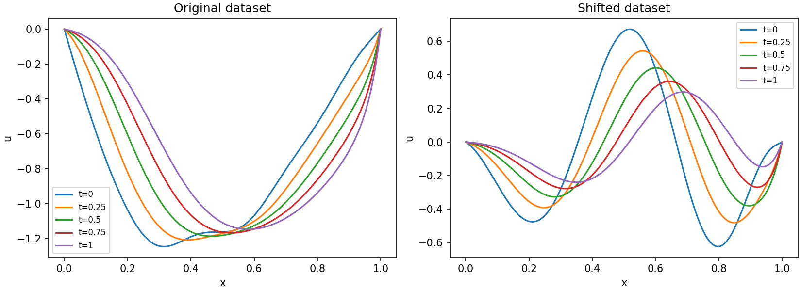

# FNO

I use a Fourier neural operator to predict the evolution of one-dimensional fields. The experiments cover spatial resolution, conditioning on elapsed time, a time-weighted loss and adaptation to a shifted dataset.

## Data

The arrays are included in `data/`. Each has shape `(trajectories,5,spatial_points)`. The five snapshots are treated as times `0,0.25,0.5,0.75,1.0`, and spatial coordinates use `linspace(0,1,n)`.

There are two collections:

* The original collection has 1,024 training trajectories and 32 validation trajectories at resolution 128. Test files contain 128 trajectories each at resolutions 32, 64, 96 and 128.
* The shifted collection has 32 trajectories for fine-tuning and 128 for testing, both at resolution 128. Its filenames contain `unknown`.

The shifted collection is used to study distribution shift; its governing equation and physical parameters are unspecified. Dataset provenance and licensing are not documented.



The preview shows the first training trajectory from each collection.

## Architecture

The fixed-time model takes position and the initial field as input. It has 128 lifting channels and three Fourier layers, each combining a spectral convolution with a pointwise convolution and GELU activation. The spectral convolutions keep up to 40 Fourier modes. The final projection uses 32 hidden units.

At a coarser resolution, a spectral layer uses `min(modes,n//2+1)` modes. The inverse transform receives the original spatial length, including for odd-sized inputs. This allows evaluation at different resolutions, but does not guarantee equal accuracy across grids.

The time-dependent model also receives elapsed time as an input channel. FiLM layers condition each Fourier block on time, starting from identity modulation.

## Experiments

The default run trains five models:

1. A fixed-time FNO for the mapping from time 0 to time 1, using 200 epochs and learning rate 0.0001.
2. A time-dependent FNO with ordinary MSE, using 50 epochs and learning rate 0.001.
3. The same time-dependent model with a time-weighted loss, using the same initialization, training pair order and schedule.
4. A copy of the weighted model fine-tuned on the 32 shifted trajectories for 100 epochs.
5. A model trained from scratch on those same 32 trajectories for the same 100 epochs.

The time-dependent models use all ten forward time pairs from each trajectory. This gives 10,240 training pairs, with four pairs at elapsed time 0.25, three at 0.5, two at 0.75 and one at 1.0 per trajectory. Pairs are constructed within each split, so a trajectory cannot leak from training into validation through pair generation.

The time-weighted objective is:

$$
L=\operatorname{mean}_{b,x}\left[(1+c\Delta t_b)(\hat u_b(x)-u_b(x))^2\right],\qquad c=1.
$$

Setting `time_weight` to zero recovers ordinary MSE. Longer horizons receive more weight per pair. This does not balance the number of pairs per horizon, and it changes the overall loss scale. Raw training losses from the weighted and unweighted models are therefore different objectives. Compare their test errors instead.

All models use Adam with weight decay 0.00001 and cosine scheduling. Pretraining selects the checkpoint with the lowest unweighted mean relative L2 error over the validation pairs. Fine-tuning starts a fresh optimizer and scheduler. Since there is no separate shifted validation set, fine-tuning and scratch training use the final epoch, without selecting on the test set.

The scratch comparison matches adaptation data and epochs. It does not match the total data or compute used by pretraining plus fine-tuning.

## Evaluation

The fixed-time FNO is tested at all four spatial resolutions. Time-dependent models are tested at each supplied horizon from the initial state. This evaluates direct predictions, not autoregressive rollouts.

Results for the weighted model are saved before fine-tuning. The fine-tuned and scratch models are evaluated on both the original and shifted test sets, so the saved metrics also show whether adaptation hurts the original distribution. Relative L2 error is computed per trajectory and then averaged; a small denominator floor keeps zero targets finite.

Run from the repository folder:

```bash
python -m FNO.run
```

Settings are in `FNO/config.json`. A custom JSON file can be passed as the first argument. The default run saves separate checkpoints, histories, metrics, training curves, a resolution plot and a shifted-data comparison. GPU training can be selected with `"device":"cuda"` on a compatible PyTorch installation.

## Files

* `data.py`: array loading, time pairs and model inputs.
* `model.py`: spectral layers, FNO and time-dependent FNO.
* `losses.py`: time weighting and relative errors.
* `train.py`: training, validation and checkpoint selection.
* `evaluate.py`: errors at each time horizon.
* `plot.py`: training and evaluation plots.
* `run.py`: training and comparisons in a fixed order.
