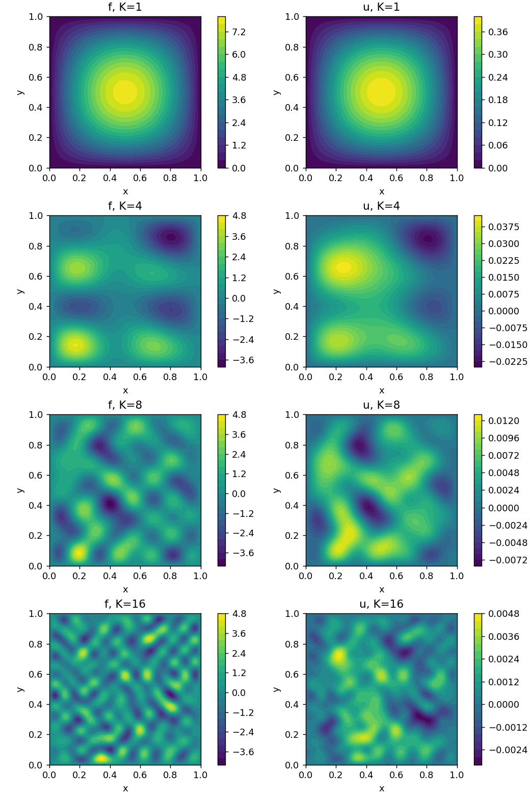

# PINN

I solve the Poisson equation on the unit square:

$$
-\Delta u=f,\qquad u=0\text{ on the boundary}.
$$

The source and solution are finite sine series. For independent standard normal coefficients $a_{ij}$,

$$
f(x,y)=\frac{\pi}{K^2}\sum_{i,j=1}^K a_{ij}(i^2+j^2)^r\sin(i\pi x)\sin(j\pi y),
$$

$$
u(x,y)=\frac{1}{\pi K^2}\sum_{i,j=1}^K a_{ij}(i^2+j^2)^{r-1}\sin(i\pi x)\sin(j\pi y).
$$

Increasing $K$ adds higher frequencies. The default experiment uses $K=1,4,8,16$, $r=0.5$ and a grid of $64\times64$ points. The source and solution use the same coefficients, so the PDE and the zero boundary values are known exactly. The generated arrays are saved in `dataset/`, with the frequency, grid size, exponent and seed in each filename.



## Models and training

Both models use a fully connected network: `2 → 128 → 128 → 64 → 32 → 1`, with tanh activations between linear layers and Xavier initialization.

The PINN minimizes the residual MSE plus 400 times the boundary MSE. The data-driven model fits the solution directly, with targets standardized using the training set. Both use Adam for 500 epochs followed by 500 L-BFGS steps, each allowing up to 20 internal iterations.

Interior and boundary points are split separately, with 80% used for training. Both models use the same split and are evaluated on the same held-out points. Evaluation includes relative L2 error on all held-out points and on the interior alone. The PINN also reports the held-out PDE residual and boundary MSE.

I use the comparison to study how harder frequency content affects training. Higher $K$ also changes the amplitudes through the series coefficients, so the absolute residual losses across different $K$ are not directly comparable. The frequency plot uses relative solution error. A single seed is an example; repeat with different `data_seed`, `split_seed` and `model_seed` values before treating a trend as general.

## Loss landscapes

The two plotting directions are the leading principal components of saved training weights. Snapshots are centered at their mean for PCA; the plotted plane passes through the final weights. Its axes are orthonormal directions in parameter space, and the plotted range covers the projected training path with a small margin.

Each plot shows the projected trajectory, the final weights, log10 loss and the variance explained by the first two components. The direction vectors and numerical surface are saved in the landscape `.npz` file.

The path is a projection: intermediate training weights generally lie outside the plane, so the surface values under the path are not their actual training losses. These plots describe two directions for one run. They do not establish how many minima exist in the full parameter space, and different models have different PCA planes and objective scales.

The landscape uses the complete training objective, including the same boundary coefficient or target normalization used during training. Set `landscape_grid` to `0` to skip it. At least three non-collinear snapshots are needed; `snapshot_every` controls how often they are saved.

## Files

* `data.py`: sine series and shared train/test splits.
* `model.py`: the tanh network.
* `losses.py`: PDE, boundary and data-driven losses.
* `train.py`: Adam, L-BFGS and trajectory snapshots.
* `evaluate.py`: solution errors and residual metrics.
* `landscape.py`: PCA directions and loss evaluation.
* `visualization/plot.py`: data, predictions, training curves and landscapes.
* `run.py`: the complete frequency experiment.

Run from the repository folder:

```bash
python -m PINN.run
```

To change the experiment, edit `PINN/config.json` or pass a different JSON file as the first argument. Training curves show the full training objective after each epoch, including after L-BFGS updates.
